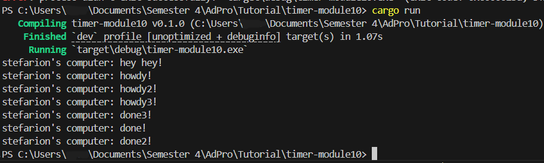

# Advanced Programming - Module 10 Timer
**Nama:**   &nbsp; Stefanus Tan Jaya 
**NPM:**    &nbsp;&ensp; 2306152456 
**Kelas:**  &nbsp; Pemrograman Lanjut A 

### 1.2 Understanding How It Works

  
Bisa dilihat bahwa "hey hey!" akan muncul lebih dulu karena pemanggilannya di luar fungsi `async`, sehingga `main` tetap melanjutkan program selagi menunggu hasil `future` dari `async`. Dengan demikian, "hey hey!" muncul lebih dulu. 

### 1.3 Multiple Spawn and Removing Drop
#### Drop Off

#### Drop On

  
Bisa dilihat bahwa dengan menghilangkan `drop(spawner)`, program tidak akan berhenti. Ketika memanggil fungsi `spawn`, `spawner` akan membuat _task_ baru yang disalurkan ke _task sender_. `Executor` akan mengambil satu _task_ dari _task sender_, kemudian mengeksekusinya, lalu mengambil _task_ lagi hingga habis dan seharusnya `spawner` di-_drop_ yang mengindikasikan bahwa interaksi sudah berakhir/selesai.